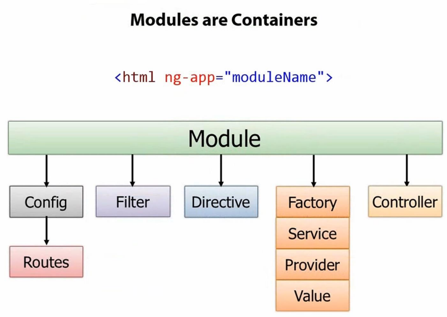

title: Angular Intro
author:
  name: sudodoki
  twitter: sudodoki
  url: http://sudodoki.name
output: index.html
theme: sudodoki/reveal-cleaver-theme

--
#[](http://angularjs.org/)
<s>
## The superheroic Javascript framework.
</s>
## HTML enhanced for web apps!

--

# [Origin](https://www.youtube.com/watch?v=X0VsStcCCM8)
+ Started in 2009 by Miško Hevery 
+ Googlefeedback: from 6 months x 3 devs (17kLoc - GWT) -> 3 weeks (1,5kLoc)
+ 20.5k⋆ on github, 4.2k commits, ~650 contributors
+ 14 core members


--

# Key Feautures
+ 2way binding
+ Templates
+ MVC
+ DI
+ Directives

--

# 2way binding
<a class="jsbin-embed" href="http://jsbin.com/nivuhuhu/8/embed">JS Bin</a><script src="http://static.jsbin.com/js/embed.js"></script>

--
# Templates
<a class="jsbin-embed" href="http://jsbin.com/qemur/1/embed?html,output">JS Bin</a><script src="http://static.jsbin.com/js/embed.js"></script>

--

# MVC
+ Model – POJO/resource disclosed via $scope.
+ View  – HTML that exists after ng compiled & binded stuff.
+ Controllers – setting of initial state of $scope & methods to control behaviour.

--

# MVW
## [](https://plus.google.com/+AngularJS/posts/aZNVhj355G2)

--

# DI
## <a class="jsbin-embed" href="http://jsbin.com/yivis/1/embed?html,output">JS Bin</a><script src="http://static.jsbin.com/js/embed.js"></script>

--

# Directives
## ng-app, ng-controller, ng-model, input, a, ng-hide
##<a class="jsbin-embed" href="http://jsbin.com/lofig/1/embed?html,output">JS Bin</a><script src="http://static.jsbin.com/js/embed.js"></script>
--

## ng-app

Your entry point

<a class="jsbin-embed" href="http://jsbin.com/nusaz/4/embed?html,output">JS Bin</a><script src="http://static.jsbin.com/js/embed.js"></script>

--

# 


--

# [Module](http://docs.angularjs.org/guide/module)
```
angular.module('myModule', []).
  config(function(injectables) { // provider-injector
    // This is an example of config block.
    // You can have as many of these as you want.
    // You can only inject Providers (not instances)
    // into the config blocks.
  }).
  run(function(injectables) { // instance-injector
    // This is an example of a run block.
    // You can have as many of these as you want.
    // You can only inject instances (not Providers)
    // into the run blocks
  });
  angular.module('otherModule', ['myModule', 'ngRoute'])
  angular.module('myModule')
    .controller('extraStuff')
```
--

## Startup
# 

--

## Controllers
Define $scope for View.
<a class="jsbin-embed" href="http://jsbin.com/saduf/1/embed?html,output">JS Bin</a><script src="http://static.jsbin.com/js/embed.js"></script>

--

## They can be nested & inherit stuff but there's a [trick](http://stackoverflow.com/a/14049482/1976857).
<a class="jsbin-embed" href="http://jsbin.com/qenop/1/embed">JS Bin</a><script src="http://static.jsbin.com/js/embed.js"></script>

--

## Filters
Formatting the value of an expression for display to user
Built-in: currency, date, filter, json, limitTo, lowercase, number, orderBy, uppercase
<a class="jsbin-embed" href="http://jsbin.com/licav/6/embed?html,js,output">JS Bin</a><script src="http://static.jsbin.com/js/embed.js"></script>

--
## [Providers](http://docs.angularjs.org/api/auto/service/$provide)
+ value
+ constant
+ factory
+ service
+ provider
<a class="jsbin-embed" href="http://jsbin.com/lixev/1/embed?html,output">JS Bin</a><script src="http://static.jsbin.com/js/embed.js"></script>
--

## [Factory vs Service vs Providers](http://stackoverflow.com/questions/15666048/angular-js-service-vs-provider-vs-factory)
<a class="jsbin-embed" href="http://jsbin.com/ohamub/1/embed?html,output">JS Bin</a><script src="http://static.jsbin.com/js/embed.js"></script>

--

# [Providers conclusion](http://code.angularjs.org/1.2.13/docs/guide/providers#providers_conclusion)

--

## [Custom Directives](http://docs.angularjs.org/guide/directive)
## [Event-loop](http://code.angularjs.org/1.0.8/docs/guide/concepts#runtime)

--

Future:
+ https://docs.google.com/presentation/d/1Gv-dvU-yy6WY7SiNJ9QRo9XayPS6N2jtgWezdRpoI04/mobilepresent
+ https://docs.google.com/presentation/d/1rno8HFYcst3nrd6xpruX7r427W5g1RRUL36115OEUnQ/mobilepresent

--

Books:
+ http://ng-cookbook.s3.amazonaws.com/ng-cookbook.pdf
+ http://www.amazon.com/Mastering-Web-Application-Development-AngularJS/dp/1782161821
+ http://shop.oreilly.com/product/0636920028055.do

--

Tutorial:
+ https://egghead.io/tags/AngularJS
+ http://docs.angularjs.org/tutorial
+ http://www.thinkster.io/pick/GUIDJbpIie/angularjs-tutorial-learn-to-build-modern-web-apps
+ http://youtu.be/tnXO-i7944M 20ish minutes version of AngularJS in 60ish minutes + http://fastandfluid.com/publicdownloads/AngularJSIn60MinutesIsh_DanWahlin_May2013.pdf - http://youtu.be/i9MHigUZKEM

--

Understading event-loop:[Make Your Own AngularJS](http://teropa.info/blog/2013/11/03/make-your-own-angular-part-1-scopes-and-digest.html)