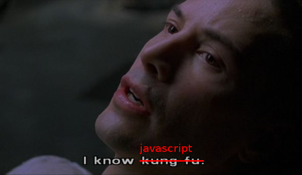
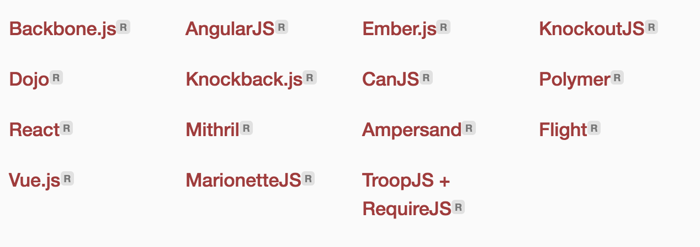

title: Basic Example
author:
  name: Джон, просто Джон.
  twitter: sudodoki
  url: http://sudodoki.name
output: index.html

--

# Outro Summer 2016

--

#
## NOW WHAT?!

--

### Well, you can try to verify, how good you know it...
+ [Puzzler](http://javascript-puzzlers.herokuapp.com/)
+ ODesk test – lots of legacy stuff
+ [Interview question](https://github.com/darcyclarke/Front-end-Developer-Interview-Questions#js)
+ [Code wars](https://www.codewars.com)

--

### [Dev-UA](http://gitter.im/dev-ua)
### [Keep up to date](http://uptodate.frontendrescue.org).
### [Visit events](http://dou.ua/calendar/tags/JavaScript/).

--

# We didn't speak about lots of stuff.
## But I just want to designate, how [universal JS is](http://developer.telerik.com/featured/what-to-expect-from-javascript-in-2016-beyond-the-browser/).

--

### JS & Hardware:
Overviewish ones (and oldie, oh gosh):
+ [JavaScript IRL](http://markdaggett.com/images/ExpertJavaScript-ch6.pdf)
+ [JS beyond web](http://www.sitepoint.com/javascript-beyond-web-2014/)  

--

### Now we're talking:
+ [Tessel](https://tessel.io/)
+ [Nodebots](http://nodebots.io/)
+ [Espruino](http://www.espruino.com/)
+ [Johny-five](https://github.com/rwaldron/johnny-five)
+ [Cylon.js](http://cylonjs.com/)

--

### Create desktop apps with [electron](http://electron.atom.io/)

--

### Create mobile apps.
+ [Titanium from Appcelerator](http://www.appcelerator.com/titanium/)
+ [Phonegap](http://phonegap.com/)
+ [React Native](http://facebook.github.io/react-native/)
+ [Native Script](http://www.telerik.com/nativescript)
--

### Go to [Enterprise](http://readwrite.com/2013/08/09/why-javascript-will-become-the-dominant-programming-language-of-the-enterprise) [or don't =)].
--

### Game development!
+ [List of JS game engines](https://gist.github.com/bebraw/768272)
+ [Phaser tutorial](http://www.photonstorm.com/phaser/tutorial-making-your-first-phaser-game)
+ [Getting started with Pixi.js](http://www.goodboydigital.com/pixi-js-tutorial-getting-started/)
+ [Impact.js tutorials](http://www.pointofimpactjs.com/tutorials/)

--

### ...using 3d!
+ [Three.js](http://threejs.org/)
+ [Babylon.js](http://www.babylonjs.com/)
+ [Three.js 3d editor](https://www.youtube.com/watch?v=CutAKGWaEBE)

--

### [Demoscene](http://js1k.com/) and Code Golf in js
+ [One](http://js1k.com/2014-dragons/demo/1903)
+ [Two](http://js1k.com/2014-dragons/demo/1951)

--
### Create browser plugins
+ [Developing chrome extension](http://code.tutsplus.com/tutorials/developing-google-chrome-extensions--net-33076)
+ [Chrome Apps](http://developer.chrome.com/apps/about_apps)
+ [Chromium & Chromium OS UX](http://www.chromium.org/user-experience)
+ [Beginners guide to greasemonkey scripting](http://www.techradar.com/news/internet/the-beginner-s-guide-to-greasemonkey-scripting-598247)
+ [Mozilla's app center](https://developer.mozilla.org/en-US/Apps/Quickstart/Build/Your_first_app)
+ [How to develop apps for Firefox OS](http://www.belenalbeza.com/2013/07/how-to-develop-apps-for-firefox-os/)
+ Book on [Firefox OS App Development](https://leanpub.com/quickguidefirefoxosdevelopment)
--

### JS is the [lingua franca of the web](http://blog.codinghorror.com/javascript-the-lingua-franca-of-the-web/)
+ [asm.js](http://asmjs.org/). [Habr's tutorial](habrahabr.ru/post/193642/)
+ [emscripten](https://github.com/kripken/emscripten). [Tutorial](https://github.com/kripken/emscripten/wiki/Tutorial)
+ [altjs.org](http://altjs.org)
+ [WebAssembly](https://webassembly.github.io/) – although not directly JS

--

# Внезапно!

--

### Web Audio API
[Web Audio API](http://chimera.labs.oreilly.com/books/1234000001552/index.html)
[Noisehack](http://noisehack.com/)
[Network build on ultrasonic](http://smus.com/ultrasonic-networking)
--

### [Web VR](https://developer.mozilla.org/en-US/docs/Web/API/WebVR_API)

--

### We didn't talk about some other APIs as well:
+ Gamepad API
+ WebRTC
+ etc.

--

### [OCR](Optical character recognition) & pixel-math-stuff
+ [Object-Detected](sudodoki.github.io/Object-Detected)
+ [OCRAD.js](http://antimatter15.github.io/ocrad.js/demo.html)
+ [OCR & Neural nets in javascript](http://ejohn.org/blog/ocr-and-neural-nets-in-javascript/)
+ [Where did water go](https://tech.bellycard.com/blog/where-d-the-water-go-google-maps-water-pixel-detection-with-canvas/)

--

### [Neural networks](https://github.com/robertsdionne/neural-network-papers) and [stuff in JS](http://nxxcxx.github.io/Neural-Network/).

--

### Left out of scope, but interesting
[High Performance Browser Networking](http://chimera.labs.oreilly.com/books/1230000000545)

--

### A lot of stuff in Serverside JS
+ [Sails](http://sailsjs.org/)
+ [Hapi](http://hapijs.com/)
+ etc. …
--

### Apart from learning language, consider learning
+ Different paradigms
+ High level conecepts
+ Algorithms and domains (data science, machine learning, etc)

--

### Different paradigms
+ OOP
+ FP
+ Logical programming
+ [You name it…](https://en.wikipedia.org/wiki/Comparison_of_programming_paradigms)

--

### High Level Concepts
+ Patterns
+ Architecture

--

### We didn't talk about lots of tools (frameworks, libs, approvaches)

--

### The function of education is to teach one to think intensively and to think critically. Intelligence plus character - that is the goal of true education.

--

# FIN

--

### Who made this possible (in Kiev):
+ [Aleksey Shvayka](https://github.com/shvaikalesh)
+ [Nikolay Kozhukharenko](https://github.com/mkozhukharenko)
+ [Ivan Stetsenko](https://github.com/firec0der)
+ [Alexander Lapshyn](https://github.com/sudodoki)
+ [Artem Suchov](https://github.com/suchov)
+ [Illia Seheda](https://github.com/ALF-er)
+ [Artem Bey](https://github.com/defly)
+ [Andrey Listochkin](https://github.com/listochkin)
+ [Julia Savinkova](https://github.com/programulya)
+ [Taras Hupalo](https://github.com/cwayfinder)

--

## [Ivan Lavriv](https://github.com/lavriv92)
## [Illya Klymov](https://github.com/xanf)

--

# We need your [Feedback](https://docs.google.com/forms/d/e/1FAIpQLSdX17IxxGoETBKC0gAo2WQs56q738Kl7ejPRPTgToc4SQA_ew/viewform)

--

# Help us
+ [Create course](https://github.com/Kottans/kottans-course-bootstrap)
+ Organize stuff
+ Help organizing stuff
