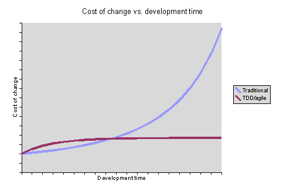

title: Testing in JS
author:
  name: Джон, просто Джон
  twitter: sudodoki
output: index.html

--

# Testing

--

# Types by means
- Manual
- Automated

--

# Types by levels
- Unit (component)
- Integration (intercomponent)
- End-to-end (E2E, system, [acceptance])

--

# Reasons
- Confidence in ones code
- Regression testing
- Cheaper to modify code
- Being able to upgrade vendor libs w/o feat=r
- Being able to answer 'Does it still work?' question
- Catching errors early

--

### When to write tests
##

--

# TDD
## Test Driven Development

--

## 

--

### Steps:
1. Add a test
2. Run all tests and see if the new one fails
3. Write some code
4. Run tests
5. Refactor code
6. Repeat
7. ???
8. Profit

--

# JS specifics
- Language stuff ([wtf](http://wtfjs.com/))
- Browser stuff

--

# JS Environments
- Node
- Headless browsers ([PhantomJS](http://phantomjs.org/), [SlimerJS](http://slimerjs.org/))
- Real browsers ([Selenium](http://www.seleniumhq.org/))

--

# Popular stacks
- [Mocha](http://mochajs.org/) (+ chai, sinon)
- [Jasmine](http://jasmine.github.io/)
- [QUnit](http://qunitjs.com/)

--

# Framework vs Runner

--

# 

--

# Intro
## BDD framework
Behaviour driven development = TDD + understandable language

--

```
describe('This is suite for, say, Subject', function () {
  var subject;
  // setup
  beforeEach(function () {
    subject = /* ... */ // create subject here
  });
  // tear down
  afterEach(function () {
    cleanup(subject) // destroy subject - return to clean state
  });
  describe('given some context', function () {
    /* more setup/teardown, other contexts */
    it('does something meaningful', function () {
      doStuff();
      expect(subject).to/* do stuff, have props,have called methods */
    });
  });
});
```

--

### Matchers
+ toBe
+ toBeCloseTo
+ toBeDefined
+ toBeFalsy
+ toBeLessThan
+ toBeNan
+ toBeNull
+ toBeTruthy
+ toBeUndefined
+ toContain
+ ..
--
+ ..
+ toEqual
+ toHaveBeenCalled
+ toHaveBeeCalledWith
+ toMatch
+ toThrow
+ toThrowError
--

# Custom matchers
## Can always create your own [matchers](http://jasmine.github.io/2.2/custom_matcher.html)

--
```
describe('Simple test', function () {
  it('verifies sum of 2 + 2', function () {
    expect(2 + 2).toBe(4)
  })
})
```
--
# Spy
A spy can stub any function and tracks calls to it and all arguments. A spy only exists in the describe or it block it is defined, and will be removed after each spec.
--

# Useful things
+ `spyOn(console, 'log')` - will catch calls to `console.log` and not call those
+ `.and.callThrough` - will call original method
+ `.and.returnValue`
+ `.and.callFake`
--
# Async stuff

```
describe('Async', function () {
  it('should just work', function (done) {
    setTimeout(function () {
      expect(something).toBla('bla');
      done();
    }, ETERNITY)
  });
});
```
--
# Running tests
- [jasmine-npm](https://github.com/jasmine/jasmine-npm)
- [karma](http://karma-runner.github.io/0.12/index.html)

--

# [TDD kata 1](http://osherove.com/tdd-kata-1/)

--
# Resources
+ [3 rules of TDD](http://butunclebob.com/ArticleS.UncleBob.TheThreeRulesOfTdd)
+ [Mock vs Stub](http://stackoverflow.com/questions/3459287/whats-the-difference-between-a-mock-stub)
+ [Frontend Testing](http://rupl.github.io/frontend-testing)